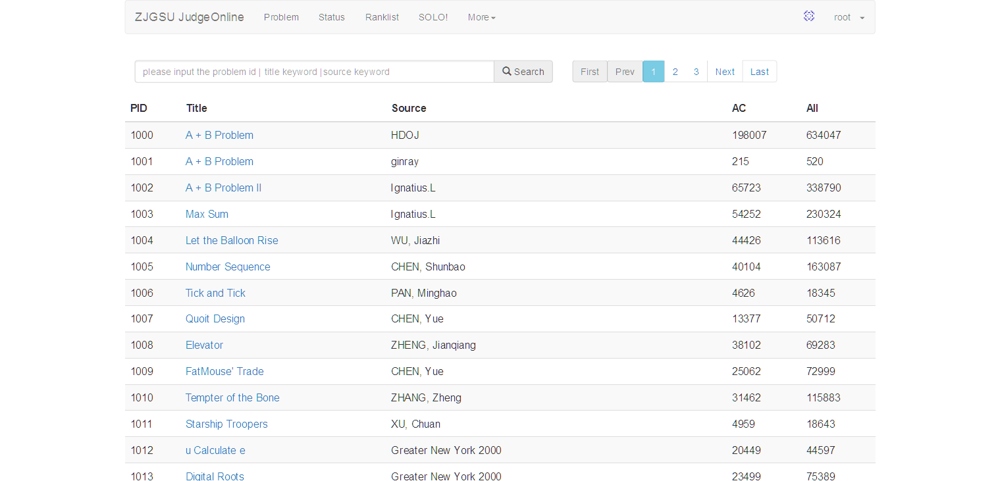
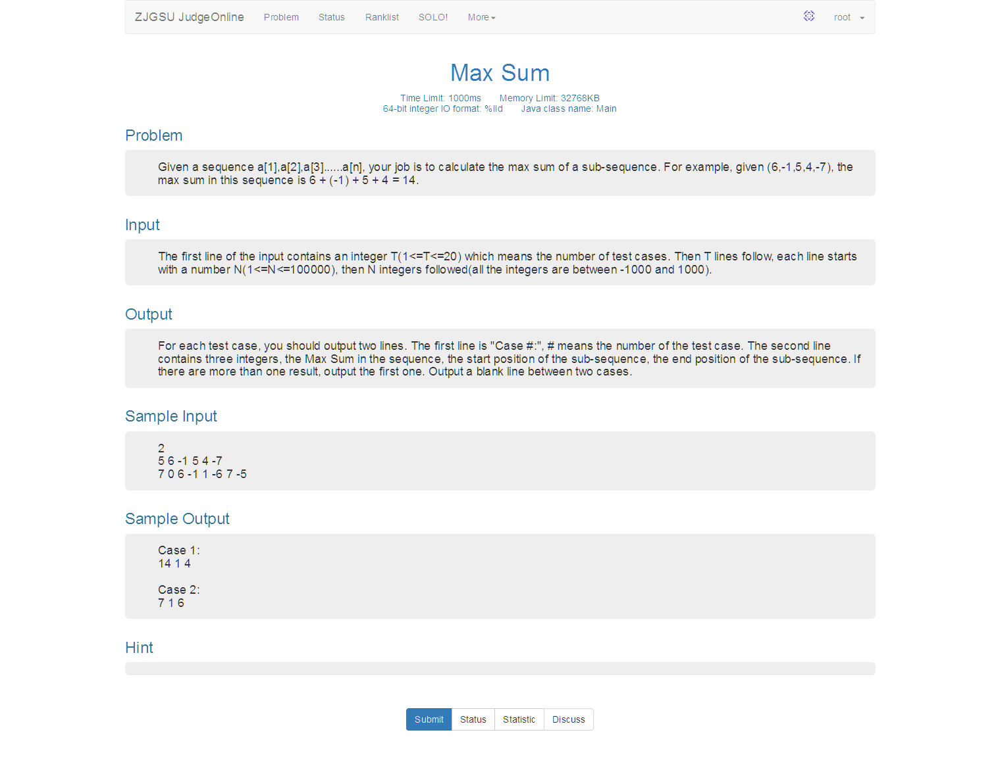
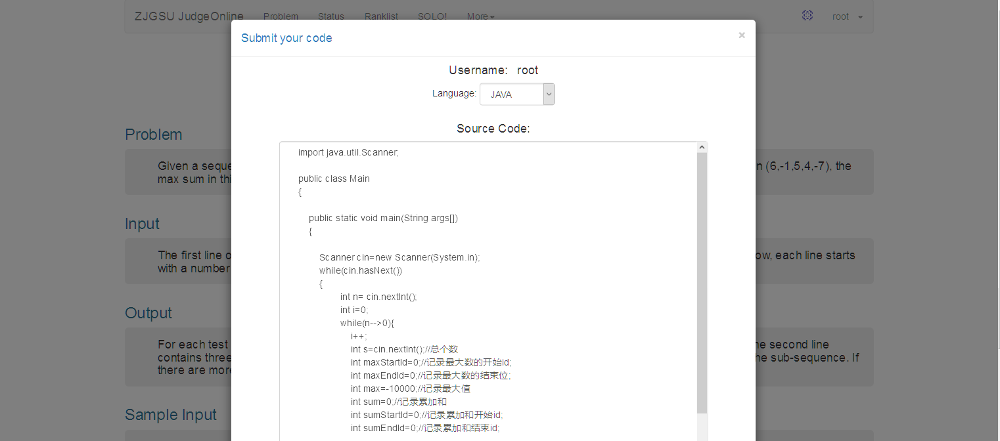
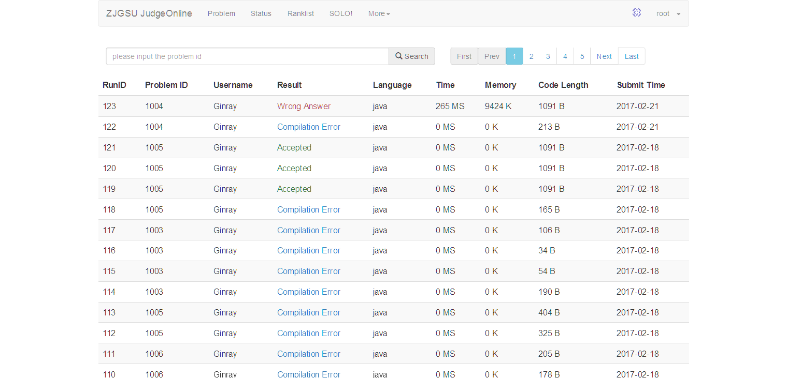

### 1、功能：

用JAVA+MySQL+Python脚本实现了OJ的基本功能，包括实现编译、运行、评判、VirtualJudge的功能。

### 2、主要界面：

2.1 首页

​	

2.1 题目列表

2.2 题目界面

2.3 提交题目界面

2. 4提交状态界面

### 3、Python Script

problem_spider 用于爬取hdu的题目 ，运行方式： python problem_spider.py。

可修改要爬取题目的题号,文件中的参数为problem_id。

submit_code 用于向hdu提交题目，运行方式： python submit_code.py。

输入参数为problem_id、language、code。将会自动登录我的账号用于提交、并返回提交状态。

需要创建目录C:\Environment\Output\Java\out用于java代码的编译。

目录C:\Environment\python_script并保存submit_code.py用于提交代码。

### 4、其他

该项目有很多不足的地方，将会继续更新下去。

有什么建议请发送至邮箱 ginray0215@gmail.com，谢谢大家。

